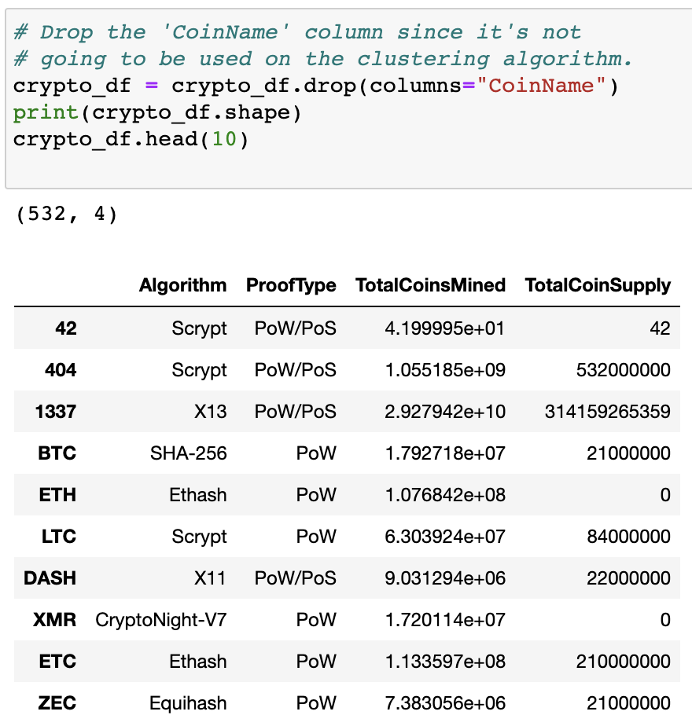
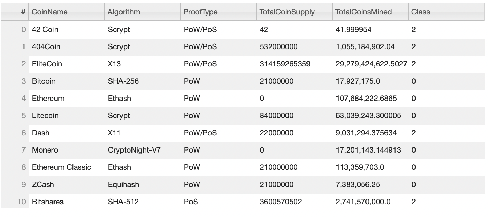
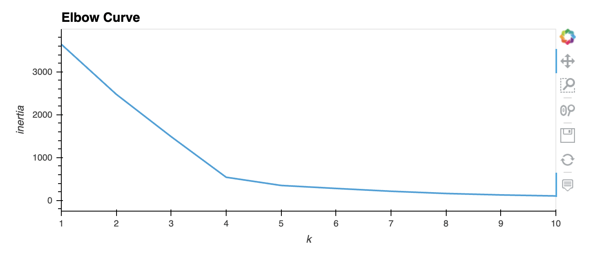
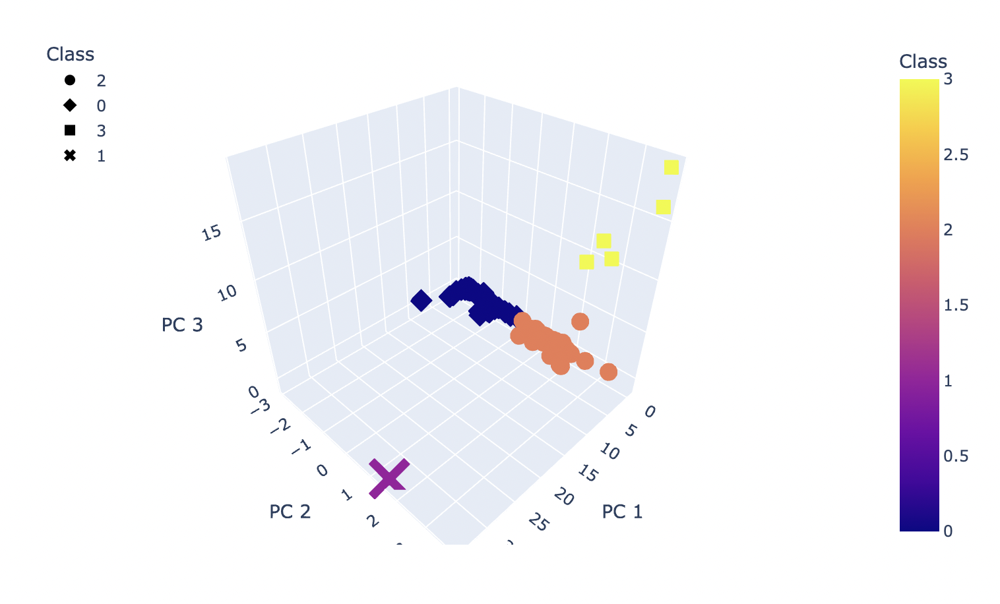
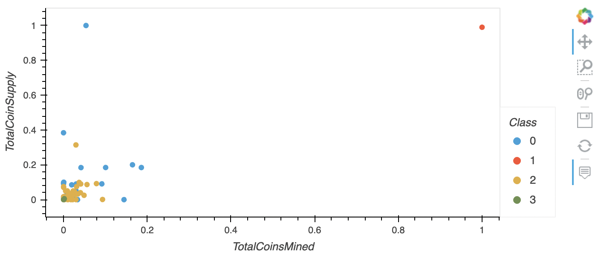

# cryptocurrencies

An analysis on cryptocurrencies dataset using unsupervised machine learning, PCA algorithm, and K-means clustering.

## Overview of Project

The purpose of this project was to analyze a cryptocurrencies dataset using unsupervised machine learning, PCA algorithm, and K-means clustering. To create a report and visualization of currently traded cryptocurrencies categorized by grouping them by their features, for a new investment portfolio on cryptocurrencies.

---

## Resource:

Data Sources: crypto_data.csv

Tools: Visual Studio Code, Jupyter Notebook, Python, Unsupervised Machine Learning, pandas, Scikit-learn, Ploty, hvPlot
 
---

## Results and Summary:

The dataset crypto_data.csv was retrieved from [CryptoCompare ](https://min-api.cryptocompare.com/data/all/coinlist), containing 1,252 entries. Only 1,144 of the cryptocurrencies were currently trading, once the null values were removed. Just cryptocurrencies that had a total number of mined coins greater than zero remained, leaving 532 tradable cryptocurrencies.

 Tradable cryptocurrencies table

Using the K-means algorithm, an elbow curve found the best k-value seems to be k=4. Settling the cryptocurrencies would have an output of 4 clusters to be categorized.

The 3-D scatter plot below made by reducing the cryptocurrencies to three principal components using the PCA algorithm.

The 2-D scatter plot shows (TotalCoinsMined on the x-axis and TotalCoinSupply on the y-axis)  the cryptocurrencies distribution of the 4 clusters. 

---
